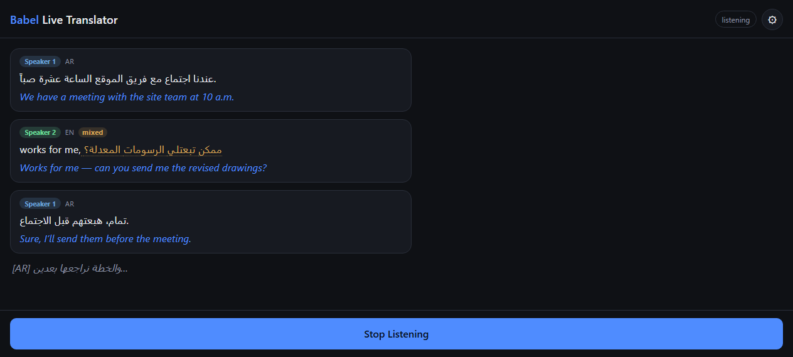

# Babel — Real-Time Audio Translator

Low-latency speech-to-speech captioning: speak in one language, read it in another while the conversation is still happening. Mic audio streams to Deepgram (streaming STT with automatic language detection and speaker labels), finalized segments stream through Groq (LLM translation), and captions land in the browser over a single WebSocket. Installable to a phone home screen as a PWA — no app store, no Mac.



*Screenshotted with sample captions (demo data) to show the full UI in one frame; live sessions render the same bubbles from real speech.*

## Quickstart

**Requirements:** Python 3.11+, a Deepgram API key, and a Groq API key. That's the whole list — no Hugging Face token, no gated model terms to accept, and no `torch` download.

```bash
cd backend
python -m venv .venv
.venv\Scripts\activate        # Windows — or: source .venv/bin/activate
pip install -r requirements.txt
copy .env.example .env        # fill in DEEPGRAM_API_KEY and GROQ_API_KEY
```

Then start the server with `run_server.bat` (Windows one-command startup — edit the two paths at the top for your machine; logs to `backend/server.log`) or directly:

```bash
cd backend
uvicorn app.main:app --reload --port 8000
```

Open **http://localhost:8000/** in a desktop browser (needs `getUserMedia` + `AudioWorklet` support, and a secure context — `localhost` counts). The server redirects `/` to the app; the `/static/index.html` path still works. Everything else in `.env.example` is optional and documented inline. Speaker separation needs no extra setup: it rides along on the same Deepgram connection as the transcript.

## Clients

- **Web / PWA** (`frontend/`) — the primary client, and the focus of active development. Mic audio → Deepgram Nova-3 (streaming STT, with automatic language detection and speaker labels) → Groq (streaming translation) → browser, over a single `/ws/stream` connection. Installable to an iPhone home screen (manifest + service worker), no app store, no Mac required. See "Quickstart" above and "Test on your phone" for the on-phone install steps.
- **iOS native app** (`ios/`) — early scaffolding only, not built or wired to the current backend. The PWA is the cross-platform path; treat `ios/` as reference material until someone picks it up. See [ios/README.md](ios/README.md).

## Layout

```
Babel/
  backend/
    app/
      main.py             FastAPI app: /ws/stream, /ws/translate, serves the frontend
      stt_session.py      Multi-connection STT: fan-out, arbitration, speaker anchor
      deepgram_client.py  Deepgram live-transcription WebSocket wrapper
      translator.py       Groq streaming translation + model selection
      config.py           Env-var settings
      schemas.py          WebSocket message shapes
    scripts/
      test_translate.py   Manual smoke test for /ws/translate
      bench_translate.py  Translation latency benchmark across Groq models
    run_server.bat        One-command Windows startup (logs to backend/server.log)
    requirements.txt
    .env.example
  frontend/                PWA: the primary phone client
    index.html            Mic capture, bubble-feed UI, settings panel
    manifest.webmanifest  PWA manifest (installable to iOS home screen)
    sw.js                 Service worker (app-shell caching)
    icons/                Placeholder PNG icons (swap for real branding)
  ios/                     Native app: secondary/reference path, needs a Mac
    Babel/                SwiftUI app source (see ios/README.md)
    project.yml            XcodeGen project manifest
  assets/                  README screenshots
  README.md
```

## How it works

1. The client opens `wss://<host>/ws/stream?lang=<target>&source_langs=<code1,code2,...>` and streams raw 16kHz mono PCM16 audio chunks (~50ms each), captured via an `AudioWorklet` in the browser (falls back to `ScriptProcessorNode` if unavailable). One upload, however many languages are selected.
2. The server plans its Deepgram connections from the candidate languages (see "Language detection" below), opens them in parallel, and broadcasts the client's audio to all of them. `diarize=true` is set on one **anchor** connection, which supplies speaker labels for the whole session.
3. Deepgram streams back interim and final transcripts. Interims are relayed immediately and untranslated for instant feedback, but only from the currently-active language, so the preview line doesn't flicker between competing transcriptions.
4. Finalized segments from different connections that cover the same audio are grouped and arbitrated: highest mean per-word confidence wins, with a stickiness bonus for the language currently being spoken. The winning transcript is emitted with a speaker label read from the anchor's word-level timeline.
5. Each final segment is translated by Groq with `stream=True`. Up to `TRANSLATION_CONCURRENCY` segments translate at once, but a single emitter forwards them **in spoken order**, so a slow response for segment 1 no longer blocks segment 2 from starting while still guaranteeing ordered output.
6. All server→client messages are structured JSON — see `app/schemas.py` for the exact shapes. Translations arrive as a stream of deltas terminated by one `final: true` message carrying latency measurements.

### Language detection

Every language you select is detected automatically; there is no toggling in normal use. How that's achieved depends on the languages:

- **Languages in Deepgram's native code-switching set** (`en`, `es`, `fr`, `de`, `hi`, `ru`, `pt`, `ja`, `it`, `nl` for Nova-3, checked 2026-08) share **one** `language=multi` connection. This is the best case: Deepgram resolves mixing *within a single sentence* and tags each word with its own language, which the UI renders inline.
- **Languages outside that set** (Arabic, Turkish, Tagalog, Tamil, Chinese, Korean) each get their **own parallel connection**. All connections hear the same audio simultaneously, so the correct-language model is always already listening — and each finalized utterance is decided afterwards by comparing confidence.

`STT_CONNECTION_BASELINE` (2) documents what a typical session costs; a session opens as many connections as its languages genuinely need, up to `STT_CONNECTION_CEILING` (4) as a runaway guard. Deepgram bills per open stream, so the Settings panel shows the stream count for a selection before you start.

An earlier version tried to auto-switch a *single* connection by running finalized transcripts through `langid.py` and reconnecting on a detected shift. That can't work: if the wrong-language connection is live when a speaker switches, it transcribes the new language with the old one's model, producing garbled text that still reads as the old language to a text classifier — so the switch is never detected. Running the connections concurrently removes the chicken-and-egg problem entirely, which is the whole reason for the fan-out.

### Mixed-language sentences

Within the code-switching set this is handled natively and well — mix English and Spanish in one sentence and you get one transcript with per-word language tags.

Across the boundary (Arabic with English words in the same sentence) no single model can do it: a single-language model renders foreign words as phonetic approximations in its own script, and code-switched speech measures 30–50% worse WER than monolingual for exactly this reason. What the app does instead is **dual-hypothesis fusion**. When two connections produce finals for the same audio and their confidence is within `FUSION_MARGIN`, both transcripts go to the translator — one has the Arabic right and the English mangled, the other the reverse — and the model reconstructs what was actually said before translating. A clear winner means monolingual speech, and the runner-up is ignored.

This recovers meaning reliably and wording usually. It will not give you a word-perfect mixed-script transcript; heavily mixed Arabic/English remains the weakest case. Turn it off in Settings to compare.

### Speaker separation

Speaker labels come from Deepgram's own streaming diarizer (`diarize=true`), which assigns a speaker index to every word in the same result that carries the transcript — so there is no timestamp alignment step and no extra latency.

This replaced a `diart`/pyannote sidecar on a second WebSocket. For streaming specifically, Deepgram is the better performer: offline pyannote is ~11% DER on AMI, but online incremental clustering (what diart does) degrades that by 5–10 points, while Deepgram's streaming diarizer reports 8–14% DER. Removing it also removed `torch`, `torchaudio`, `torchvision`, `matplotlib` and a pinned `huggingface_hub` — and with them diart's `numpy<2.0` pin, which was the only thing forcing Python ≤3.12.

Because speaker indices are per-connection and wouldn't agree across languages, exactly one connection is the diarization **anchor**, and every segment's label is read from its timeline. Deepgram's diarization is acoustic, so the anchor's segmentation is valid for an utterance any connection transcribed.

## `/ws/translate`

Accepts `{"segment_id", "text", "target_lang"}` JSON requests and streams back translation deltas (same message shape as `/ws/stream`'s), reusing `translator.py`. For a client that already has transcribed text and just needs a cloud translation; the PWA doesn't need it since `/ws/stream` already returns translated text.

```bash
cd backend
python scripts/test_translate.py "Hello, how are you?" Spanish
```

## Test locally (desktop)

1. Start the server as above and open the page.
2. Tap the gear icon, pick a target language and every language you expect to hear, close Settings. The panel shows how many Deepgram streams that selection will open and which translation model it will use.
3. Click **Start Listening**, grant microphone permission.
4. Speak — a bubble appears per finalized segment, tagged with its speaker and language, source text first and translation shortly after. An italic line above the bubbles shows the current interim transcript. Switch languages mid-conversation without touching anything.
5. Click **Stop Listening** to close the mic and WebSocket cleanly.
6. `GET /health` returns `{"status": "ok"}` for a quick backend liveness check.

## Test on your phone

1. Make sure your phone and the machine running the backend are on the same network, and find that machine's LAN IP (e.g. `ipconfig getifaddr en0` on a Mac, `ipconfig` on Windows).
2. On the backend machine, run `uvicorn app.main:app --host 0.0.0.0 --port 8000` (note `--host 0.0.0.0` — the default `127.0.0.1` only accepts connections from the same machine; `run_server.bat` already does this) and make sure the OS firewall allows inbound connections on port 8000.
3. On the phone, open Safari to `http://<LAN-IP>:8000/`.
4. Tap **Share → Add to Home Screen** (the app shows a one-time banner reminding you of this, since Safari has no automatic install prompt). Launching from the home screen icon runs it in standalone mode (no browser chrome) and keeps the screen awake while listening (Screen Wake Lock API).
5. In Settings, the Backend field can stay blank (same-origin) since you loaded the page directly from the backend's address.
6. Everything else matches the desktop flow above. Speaker separation is always on and needs no backend setup.

### Sanity-checking the pipeline pieces independently

- Deepgram connectivity: bad/missing `DEEPGRAM_API_KEY` surfaces as a `{"type": "error", ...}` message immediately on connect (visible in the status pill and browser console).
- Groq connectivity: a translation failure surfaces as `{"type": "error", "data": "Translation failed: ..."}` without tearing down the transcript stream.
- Translation latency: `python scripts/bench_translate.py --target Arabic` measures time-to-first-token per model, including the pre-tuning configuration as a baseline row.
- Watch server logs (`uvicorn` stdout or `backend/server.log` when using `run_server.bat`) — the STT session logs its connection plan and diarization anchor on connect, and each segment logs its translation timings.

## Notes on the design choices

- **Why concurrent translation with an ordered emitter:** translating segments fully in parallel would let a slow response for segment 1 finish after segment 2, rendering them out of order. The previous fix was a single serial worker, which preserved order but also meant segment 2 couldn't *start* until segment 1 had finished streaming. Now each segment translates immediately into its own queue and one emitter drains those queues in segment order — same ordering guarantee, without the head-of-line blocking.
- **Why `endpointing` is the latency dial that matters:** translation itself now runs in ~50-100ms, so the silence threshold before Deepgram finalizes a segment is most of the perceived wait. Lower is more responsive but fragments sentences across bubbles, and fragments translate worse having lost the rest of the sentence for context. See `ENDPOINTING_MS` in `.env.example`.
- **Why stride-decimation resampling in the worklet:** it's cheap enough to run per-sample in the audio thread and is sufficient quality for speech STT; it intentionally skips an anti-aliasing filter for simplicity. If you see STT quality issues, that's the first place to upgrade (e.g. a proper polyphase resampler).
- **Model choice:** `GROQ_MODEL_MODE=auto` picks per session — `llama-3.3-70b-versatile` when every language in play is one it officially supports (en/de/fr/it/pt/hi/es), `openai/gpt-oss-120b` otherwise. That split exists because llama-3.3's official language list covers none of Arabic, Tagalog, Tamil, Chinese, Japanese, Korean or Turkish, while gpt-oss scores 82.7/82.9 on Arabic/Korean MMMLU. gpt-oss is a reasoning model, so it's sent with `reasoning_effort="low"`; measured first-token cost is ~330ms against ~60ms for llama-3.3. Force either with `GROQ_MODEL_MODE=fast|quality` or the Settings panel.
